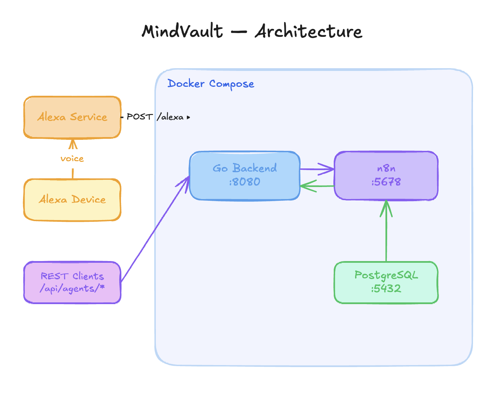
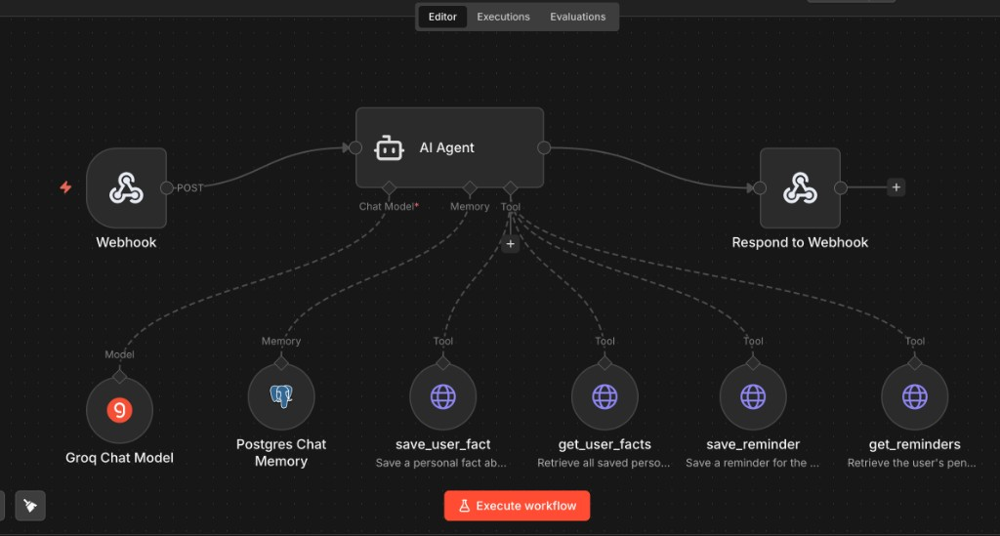

# MindVault [WIP]

> An AI-powered second brain that remembers who you are, captures what you read, and keeps your notes, summaries, and reminders synced to your Obsidian vault.

Holds natural multi-turn conversations across sessions, learns your preferences and persona over time, and lets you spin up new agents without writing a single line of code.

Built on **n8n** AI agent workflows and **Groq** (free tier), backed by persistent memory in **PostgreSQL**. Talk to it through **Alexa**, a **REST API**, or any client that speaks HTTP.


## Architecture



**Flow:** User speaks to Alexa (or calls the REST API) → the request is routed to the matching n8n AI Agent → the agent reasons over the query using its tools and memory → the response flows back as Alexa speech or JSON.

Any agent can also be reached directly via `POST /api/agents/{name}`, making it easy to integrate with Slack bots, web UIs, mobile apps, or anything that speaks HTTP.

## Quick Start

### Prerequisites

- Docker & Docker Compose
- A Groq API key (free at https://console.groq.com)
- (Optional) Go 1.23+ for local development

### 1. Configure environment

```bash
cp .env.example .env
```

Edit `.env` and set at minimum:
- `GROQ_API_KEY` — your Groq API key (from https://console.groq.com/keys)
- `N8N_ENCRYPTION_KEY` — any random string for n8n credential encryption

### 2. Start all services

```bash
docker compose up -d
```

This starts:
- **PostgreSQL** on port 5432 (internal — stores agent memory, user facts, and reminders)
- **n8n** on port 5678 (agent workflow engine, accessible at http://localhost:5678)
- **Backend** on port 8080 (routes requests from Alexa and the API to the right agent)

### 3. Set up the Personal Assistant workflow

#### Import the workflow

1. Open n8n at http://localhost:5678
2. Click **Add workflow** (or the **+** next to Workflows) → **Import from file**
3. Select `n8n/workflows/personal-assistant.json`
4. Save the workflow (e.g. name it "Personal Assistant")

The imported workflow looks like this:



The workflow is built from the following nodes:

| Node | Role |
|---|---|
| **Webhook** | Entry point — receives `POST` requests from the Go backend |
| **AI Agent** | Orchestrates the LLM call and decides which tools to invoke |
| **Groq Chat Model** | The LLM powering the agent (uses your Groq API key) |
| **Postgres Chat Memory** | Stores conversation history per user+session for multi-turn context |
| **save_user_fact** | Tool — persists personal facts the user shares (name, location, preferences…) |
| **get_user_facts** | Tool — retrieves stored facts to personalize every response |
| **save_reminder** | Tool — stores a reminder with an optional due date/time |
| **get_reminders** | Tool — lists pending reminders for the user |
| **Respond to Webhook** | Returns the AI Agent's final answer back to the Go backend |

**Data flow inside the workflow:**
1. The Webhook node receives `{ query, sessionId, userId }` from the backend.
2. The AI Agent loads the user's facts and conversation history, then decides which tools to call.
3. Tools read/write to PostgreSQL (facts and reminders tables).
4. The agent composes a final response and Respond to Webhook sends it back.

#### Add credentials

**Groq API key**

1. Click the **Groq Chat Model** node on the canvas.
2. In the **Credential** dropdown, choose **Create New Credential** → **Groq API**.
3. Paste your key from https://console.groq.com/keys and save.

**Postgres**

1. Click the **Postgres Chat Memory** node → **Create New Credential** → **Postgres**.
2. Use these values (matching `docker-compose.yml`):
   - Host: `postgres`
   - Port: `5432`
   - Database: `n8n` (or your `POSTGRES_DB` value)
   - User: `n8n` (or your `POSTGRES_USER` value)
   - Password: `n8n_password` (or your `POSTGRES_PASSWORD` value)
3. Save. Then open each of the four tool nodes (**save_user_fact**, **get_user_facts**, **save_reminder**, **get_reminders**) and assign the same Postgres credential.

#### Activate

Toggle **Active** (top-right switch) to turn the workflow on. The webhook is now live and the backend can reach it.

### 5. Test via API

```bash
curl -X POST http://localhost:8080/api/agents/personal-assistant \
  -H "Content-Type: application/json" \
  -d '{"query": "Hi! My name is Raj and I live in Pune.", "sessionId": "test-1", "userId": "user-1"}'
```

Test that it remembers you:

```bash
curl -X POST http://localhost:8080/api/agents/personal-assistant \
  -H "Content-Type: application/json" \
  -d '{"query": "What do you know about me?", "sessionId": "test-2", "userId": "user-1"}'
```

Test reminders:

```bash
curl -X POST http://localhost:8080/api/agents/personal-assistant \
  -H "Content-Type: application/json" \
  -d '{"query": "Remind me to call the dentist tomorrow at 10am", "sessionId": "test-3", "userId": "user-1"}'
```

### 6. Connect Alexa

1. Create a Custom Skill in the [Alexa Developer Console](https://developer.amazon.com/alexa/console/ask)
2. Set the endpoint to your backend's public URL + `/alexa` (use ngrok for development)
3. Define intents with a catch-all slot (e.g., `AskQuestionIntent` with slot `{query}`)
4. Set `ALEXA_SKILL_ID` in `.env` and `ALEXA_VERIFY_REQUESTS=true` for production

## Adding New Agents

Adding a new agent requires **zero code changes** — everything is configured through n8n and environment variables:

1. **n8n**: Create a new workflow with a Webhook trigger (e.g., path: `my-new-agent`) → AI Agent → Respond to Webhook
2. **Config**: Add the intent mapping in `INTENT_AGENT_MAP` env var: `{"MyNewIntent": "my-new-agent"}`
3. **Alexa** (optional): Add the new intent with sample utterances in the Alexa Developer Console

You can also call any agent directly via the API without Alexa:

```bash
curl -X POST http://localhost:8080/api/agents/my-new-agent \
  -H "Content-Type: application/json" \
  -d '{"query": "your question here"}'
```

## API Reference

### Health Check

```
GET /health
→ {"status": "ok"}
```

### Alexa Skill Endpoint

```
POST /alexa
Content-Type: application/json
Body: Alexa request JSON (sent automatically by Alexa service)
→ Alexa response JSON
```

### Generic Agent API

```
POST /api/agents/{name}
Content-Type: application/json
Body: {"query": "your question", "sessionId": "optional-session", "userId": "optional-user", "metadata": {"key": "value"}}
→ {"response": "agent's answer"}
```

## Environment Variables

| Variable | Default | Description |
|---|---|---|
| `SERVER_PORT` | `8080` | Port for the backend API |
| `N8N_WEBHOOK_BASE_URL` | `http://n8n:5678` | n8n internal URL |
| `ALEXA_SKILL_ID` | (empty) | Your Alexa Skill ID for request validation |
| `ALEXA_VERIFY_REQUESTS` | `false` | Enable Alexa signature verification |
| `DEFAULT_AGENT` | `general-assistant` | Fallback n8n agent for unmapped intents |
| `INTENT_AGENT_MAP` | `{}` | JSON mapping of Alexa intent → n8n agent path |
| `GROQ_API_KEY` | (empty) | Groq API key for the LLM (free tier at console.groq.com) |

## Local Development

```bash
# Run without Docker
export N8N_WEBHOOK_BASE_URL=http://localhost:5678
go run ./cmd/server

# Or build and run
go build -o server ./cmd/server
./server
```

## Memory, Persona, and Reminders

The **Personal Assistant** workflow uses three independent layers of persistence, all backed by the shared Postgres instance:


**Conversation Memory (`n8n_chat_histories` table)**
n8n's built-in Postgres Chat Memory node stores the full message history scoped by `sessionId`. The agent automatically receives recent messages as context so it can follow multi-turn conversations without the client re-sending history.

**User Persona (`user_facts` table)**
When you share personal information (name, location, preferences, habits), the agent detects it and calls `save_user_fact` to persist it. At the start of every subsequent conversation `get_user_facts` retrieves your stored profile so the agent can personalize responses from the first message. Facts are tagged by category: `identity`, `preference`, `location`, `work`, `family`, `interest`, `habit`.

**Reminders (`reminders` table)**
Ask the agent to set a reminder and it calls `save_reminder` with the text and an optional due datetime. Ask "what are my reminders?" and it calls `get_reminders` to retrieve them. Reminders are scoped by `userId` and persist across sessions and container restarts.

All three stores are scoped by `userId` (and `sessionId` for chat history), so multiple users can share the same deployment without data leaking between them.

## Project Structure

```
mindvault/
├── cmd/server/main.go            # Entry point, routing, middleware
├── internal/
│   ├── alexa/
│   │   ├── handler.go            # Alexa HTTP handler
│   │   ├── models.go             # Alexa request/response structs
│   │   └── verifier.go           # Signature verification
│   ├── n8n/
│   │   └── client.go             # n8n webhook HTTP client
│   ├── config/
│   │   └── config.go             # Env-based configuration
│   └── api/
│       └── handler.go            # Generic agent API handler
├── db/
│   └── init.sql                  # Postgres schema (user_facts, reminders)
├── n8n/
│   └── workflows/
│       └── personal-assistant.json  # Importable n8n workflow template
├── docker-compose.yml
├── Dockerfile
└── .env.example
```
